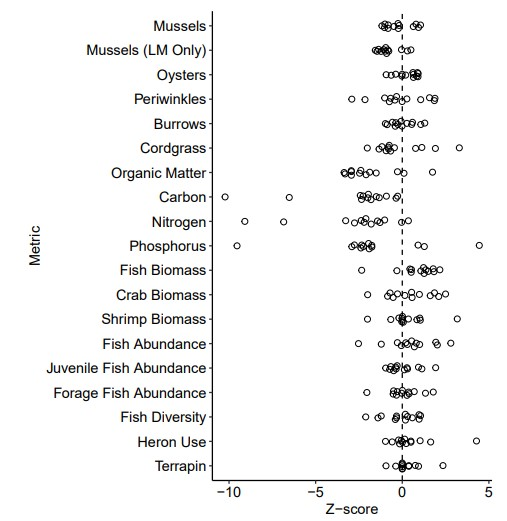

```{r setup, include=FALSE}
knitr::opts_chunk$set(echo = TRUE)
```

## Introduction

The paper I have chosen to summarize is "Living shorelines achieve functional
equivalence to natural fringe marshes". The bibliotic information is as follows:
Isdell RE, Bilkovic DM, Guthrie AG, Mitchell MM, Chambers RM, Leu M, Hershner C. 2021. Living shorelines achieve functional equivalence to natural fringe marshes across multiple ecological metrics. PeerJ 9:e11815 https://doi.org/10.7717/peerj.11815
The geographic location that this paper is from is the Chesapeake Bay area in Virginia, US.
  
As our climate is changing and many ecosystems are experiencing negative changes. It is important to protect and restore natural areas that provide benefits and co-benefits. This paper aims to determine if there are any ecological differences between natural fringing marshes and living shorelines. Living shorelines are a type of nature-based solution that are the human-implemented compliment of fringing marshes. If the findings show that there are major differences within the ecological function of the living shorelines, it is then known that the implementation of them is not going to aid in the adaptation and restoration process of climate change. Vis versa, if results show similarities in ecological function.
  

## Methods

In order to gather data, 13 different pairs of living shorelines and fringing marshes within close proximity were analyzed between the years 2018-2019.  The parameters that were measured within the field were invertebrates, plants, nekton, heron, terrapin, age, and soil elements. In order to collect data on soil, 20cm cores were taken from areas with S. alterniflora present. They were then analyzed for carbon phosphorus, and nitrogen abundance. Other methods of data extraction for biotic organisms were by visual surveys, nets and traps, and cameras.

The metrics recorded were compared, contrasted, and combined using a statistical analysis, the Z-Score. A Z-score shows how far away from the mean the data is. Any Z-score between -1 and 1 is considered to be functionally equivalent. This method is then used to determine if the function of the parameters in the living shorelines is equivalent to the natural fringing marshes. 

## Results and Conclusion

The results of the data were that the living shorelines were functionally equivalent in all parameters other than the soil properties. The soil properties were lacking in functional equivalency, as the soil used were clean which meant they were lacking organic material and had a high bulk density. Some parameters functioned better in the living shorelines than they did in fringing marshes, such as some of the nekton species. 





In conclusion, living shorelines are a great way to create more habitat for organisms.Living shorelines are a way to restore and adapt fringing marsh ecosystems in the face of climate change. As we move away from hard engineering structure to protect our coastlines, living shorelines in the Chesapeake Bay area should be highly considered. 


